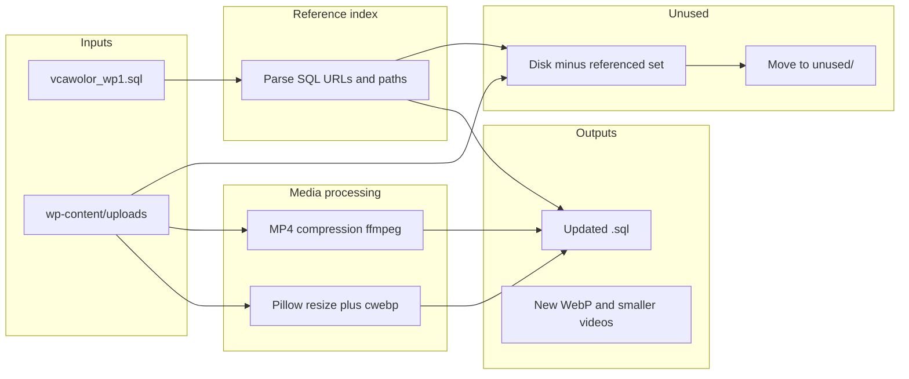

# WordPress uploads optimization (Python + SQL)

## Current workspace note

The repo currently contains only `[vcawolor_wp1.sql](vcawolor_wp1.sql)`. There is **no `uploads` folder** (i.e. `wp-content/uploads` on the live site) in the workspace yet.

**Media scope**: All file operations (scan, compress, WebP, move unused) target `**wp-content/uploads`** only—not plugins, themes, or the rest of `wp-content`. The CLI default should be `**--uploads` = root of that Uploads directory** (the folder that contains `2021/`, `2022/`, etc.). Example: `--uploads /path/to/wp-content/uploads` alongside `--sql vcawolor_wp1.sql`.

## Clarifications applied

- **HQ images**: resize so the **long edge is at most 1920px** (preserve aspect ratio), then encode WebP via `cwebp`.
- **Video (MP4 etc.)**: cap display resolution at **1200px on the long edge** (preserve aspect ratio) as the target “perfect” web size before/while tuning bitrate—then still enforce the **≤ 20 MB** file-size target via CRF/bitrate steps as needed.
- **Priority folders (this site)**: `**uploads/2022/10`** and `**uploads/2022/11`** hold the **largest** media (especially heavy videos). The tooling should **prioritize these paths**: process them **first**, log them **prominently**, and optionally print a **pre-run “largest files” report** (top N by bytes site-wide, with those two months highlighted). Default CLI can include `--priority-subdirs 2022/10,2022/11` or equivalent baked in as defaults for this project.
- **SQL updates**: **no WP-CLI**; use **Python orchestration** and fix PHP-serialized strings correctly (PHP CLI helper is appropriate here—WordPress `meta_value` is PHP `serialize()` output, not JSON).

## Architecture

## 1) Step — Compress MP4 and other video files (ffmpeg, ≤ 20 MB)

**This step is where MP4 (and `.mov` / `.webm` / `.m4v`) compression happens.** It is separate from image WebP work in §3.

**Tooling**: `ffmpeg` (and optionally `ffprobe` for duration/dimensions).

**Logic** (scripted, not a single magic command):

- **Priority**: Under the uploads root, treat `**2022/10`** and `**2022/11`** as high-attention directories—**enumerate and transcode videos there before** other month folders (or sort the global queue so files under those paths are handled first). Same idea for large raster images in those folders during §3.
- Enumerate video files under `uploads/` (extensions: `.mp4`, `.mov`, `.webm`, `.m4v`; match `post_mime_type` / `_wp_attachment_metadata` in SQL when available for prioritization).
- For each file over **20 MB** (or always re-encode with a `--force` flag):
  - Prefer **H.264 + AAC** in `.mp4` for broad web compatibility (unless you later choose VP9/AV1 as an option).
  - **Scale so the long edge is at most 1200px** (e.g. `ffmpeg` `scale=` with `force_original_aspect_ratio=decrease`) as the default “perfect” web footprint; sources smaller than that are not scaled up.
  - Start from a quality-oriented preset (e.g. **CRF ~23–28** at that resolution) and measure output size.
  - If still **> 20 MB**, reduce quality (raise CRF) in steps; optional further downscale only if already at a configured minimum dimension—**log** when the target cannot be met without unacceptable quality.
- Write outputs **next to originals** with a clear naming strategy documented in code, e.g. replace in place after backing up to `unused/` or a `backup/` folder (configurable). **Replacing `.mov` with `.mp4`** implies SQL URL updates for those paths.

**Important**: This is **independent** of `cwebp` (video is not WebP).

## 2) Unused / “orphan” files → `[unused/](unused/)`

**Definition**: Files under `wp-content/uploads/` that are **not referenced** anywhere your indexer extracts from the dump.

**Build the “referenced” set** from `[vcawolor_wp1.sql](vcawolor_wp1.sql)`:

- Regex / lightweight parsing to collect URLs and paths containing `/wp-content/uploads/` (and site URL variants: `http://www.vcawol.org.au`, `https://www.vcawol.org.au`, path-only).
- Include `**wp_posts.guid`** for attachments, `**post_content`**, `**wp_postmeta.meta_value`** (both plain and serialized—see §4), `**wp_options**`, and other tables that reference media (e.g. `wp_blc_instances.raw_url` patterns already present in the dump).
- Normalize to a **canonical relative path** under `uploads/` (year/month/filename).

**Disk scan**: walk the **Uploads root** (same as `wp-content/uploads` on the server), skip the `unused/` folder inside it if present.

**Move**: files whose relative path is not in the referenced set → mirror structure under `unused/` (e.g. `unused/2022/07/foo.jpg`) so nothing is lost and you can restore.

**Caveat**: WordPress often has **derived sizes** (`-1024x768.jpg`). The indexer must treat a reference to `photo-1024x768.jpg` as **not** orphaning `photo.jpg` if both are expected; conversely, unreferenced intermediates may still be movable. The plan is to treat **any filename** that appears in the SQL text as referenced; optional `--aggressive` mode could drop sizes only referenced via `_wp_attachment_metadata` (requires parsing attachment metadata—stronger but more work).

## 3) Images: resize + WebP via `cwebp`

**Priority**: When scanning for images, apply the same **2022/10** and **2022/11** first-pass ordering as in §1 so the heaviest folders get WebP + resize attention early (and show up in any largest-files report).

**Pipeline per raster image** (skip PDFs, SVGs, videos):

- Open with **Pillow**; resize so **max(long edge) = 1920** (your choice).
- Encode with `**cwebp`** (CLI), quality ~**80–85** as default (configurable `-q`).
- **Output naming**: write `**basename.webp`** alongside or **replace** the original—your request says replace with generated WebP; implementation should **move originals** to `unused/` or a dated backup directory before overwrite, to allow rollback.

**Skip / special cases**:

- Already `.webp`: optionally re-encode only if larger than threshold or `--force`.
- **Transparency** (PNG/GIF): use lossless WebP or `-alpha_q` as needed so edges stay clean.

## 4) SQL: change image extensions to `.webp` (serialized-safe)

**Why this is hard**: `wp_postmeta.meta_value` often contains **PHP-serialized** strings. Naive `.jpg` → `.webp` text replace **breaks** `s:N:"..."` **length prefixes** when `N` changes.

**Chosen approach (python_only + PHP)**:

- **PHP CLI helper** (small `tools/wp_serialize_patch.php` or similar) that:
  - Accepts a `meta_value` string.
  - If it looks like PHP serialized data, `unserialize()`, recursively walk arrays/objects and replace URL strings (domain-agnostic or configurable site URL), then `serialize()` back.
  - If not serialized, return plain string replace for upload URLs only.
- **Python** drives: read SQL, identify `INSERT INTO` blocks for tables that need updates, or **stream** the file and apply row-wise processing for `wp_postmeta`—depending on file size, a **streaming line-based** approach may be insufficient because INSERT rows can be huge; a pragmatic pattern is:
  - **Either** load into a **temporary local MySQL** with `mysql` CLI from Python and dump again (still “Python orchestrated”, no WP-CLI),
  - **Or** use a **robust SQL dump parser** (e.g. process INSERT tuples with a state machine).

**Minimum viable path** that stays reliable: **temporary MySQL import** + `UPDATE` via Python `pymysql` calling the PHP helper per `meta_value` row for serialized keys, then `mysqldump` to produce `**vcawolor_wp1.webp-updated.sql`**. If you strictly need **no MySQL at all**, the plan documents the higher risk: full dump parsing in Python + PHP per value only where `INSERT` rows can be extracted intact.

**Tables to update** (at least):

- `wp_posts`: `post_content`, `guid` (image attachments only).
- `wp_postmeta`: all `meta_value` rows (via PHP helper).
- `wp_options` where values contain upload URLs (option_name patterns like `*_transient_*`, theme mods—optional pass).

**Video path updates**: if `.mov` → `.mp4`, same serialization rules apply wherever those URLs appear.

## 5) Deliverables (files to add)

| Artifact                      | Purpose                                                                                                                                                                                   |
| ----------------------------- | ----------------------------------------------------------------------------------------------------------------------------------------------------------------------------------------- |
| `requirements.txt`            | `Pillow`, `pymysql` or `mysqlclient` (if using temp DB), optional `tqdm`                                                                                                                  |
| `scripts/media_optimize.py`   | CLI: `--videos` / `--images` / `--all` with **default priority** on `2022/10` & `2022/11`; optional `--priority-subdirs`; `--report-largest` for pre-run audit; `--unused`; `--sql-patch` |
| `tools/serialize_patch.php`   | PHP: safe unserialize → replace URLs → serialize                                                                                                                                          |
| `README.md` (only if you ask) | Skipped per your preference unless you want usage docs                                                                                                                                    |

## 6) Preconditions (your environment)

- **ffmpeg**, **ffprobe**, **cwebp**, **php** on `PATH`.
- The `**uploads`** directory (`wp-content/uploads` from WordPress) available at the configured `**--uploads`** path (full tree of year/month files).
- Sufficient disk space (backups + WebP + encoded videos).

## 7) Risks and mitigations

| Risk                                     | Mitigation                                                                                                       |
| ---------------------------------------- | ---------------------------------------------------------------------------------------------------------------- |
| Broken serialization                     | PHP `unserialize`/`serialize` path only; tests on a few `meta_value` samples first                               |
| WordPress expects `.jpg` in theme/plugin | Prefer keeping originals in backup; consider serving WebP via plugin—your spec asks for replacement + SQL update |
| SQL file size (~44M+ chars)              | Streaming or temp DB round-trip                                                                                  |

## 8) Implementation order

1. URL indexer from SQL + unused file mover (no media change)—validates references.
2. Image resize + `cwebp` + backup originals.
3. **Compress MP4 / video files (explicit step):** run `**--videos`** / the §1 ffmpeg pipeline on files under `**--uploads`**. Start with `2022/10` and `2022/11` (largest files). Re-encode large `**.mp4`** files and sources like `**.mov**` to H.264 + AAC in `**.mp4**`, with **max long edge 1200px**, then iterate CRF/bitrate until size is **≤ 20 MB** per file (or log if the quality floor is hit). Back up or replace in place per script options; if `.mov` becomes `.mp4`, schedule SQL URL updates in step 4.
4. SQL regeneration / patch with PHP serialization helper (last, after paths are stable—including any `.mov` → `.mp4` and `.webp` URL changes).

